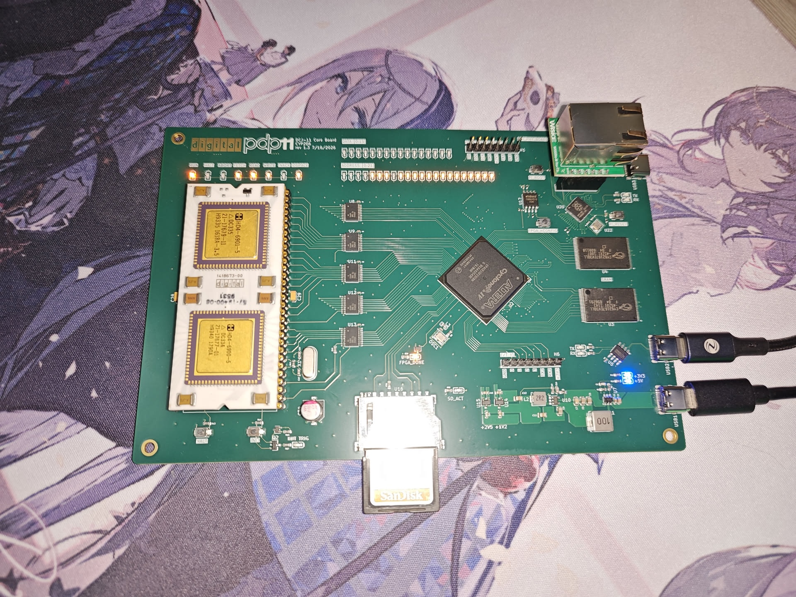
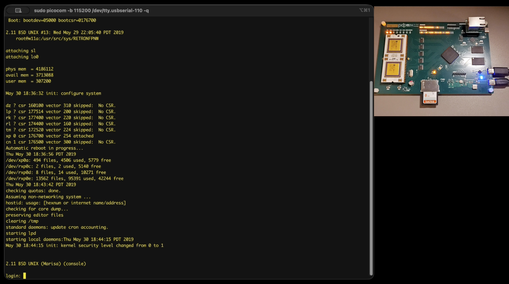
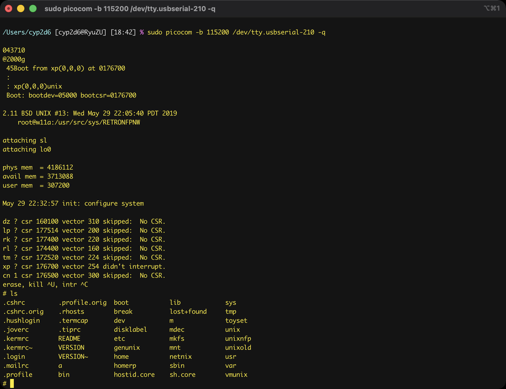
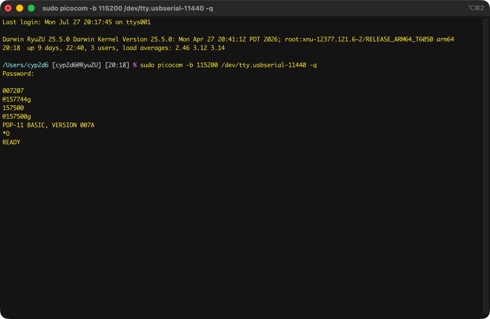

# DEC DCJ-11 PDP-11 Replication Project

Hardware specification and implementation status for the validated v1.3 hardware revision.

## Hardware Specifications 

* **CPU:** DEC DCJ-11
* **FPGA:** Intel/Altera Cyclone IV EP4CE15F23C8N
* **SRAM:** 2× Cypress Semiconductor CY62167EV30LL-45/55ZXI
* **FPGA Configuration Flash:** Winbond W25Q64JVSSIQ
* **UART Interface:** WCH CH340N
* **Bus Transceivers:** 5× Texas Instruments SN74CB3T3245
* **LED Controllers:** 2× Awinic AW21024
* **Status Indicators:** 
    * 8× Onboard direct LEDs (RUN, HALT, ABORT, FETCH, READ, WRITE, IO_SPACE)
    * 16-bit Data bus and 22-bit Address bus LEDs (Driven via AW21024 controllers)
* **MCU & Ethernet Subsystem for DEQNA (v1.3 Integrated):**
    * RP2040 MCU
    * Reserved expansion header for Wiznet W5500 SPI Ethernet PHY module
---

## Implementation and Validation Status

### Full 2.11 BSD Unix Implementation for v1.3 Board
System intergration for running full multi-user mode 2.11 BSD Unix via RP06 disk.
* **Functionality:**
  * Power-on configuration and pre-loading 45Boot bootloader into SRAM starting at octal address `2000`.
  * Full 4 MiB physical SRAM memory mapping exploiting the 22-bit address space.
  * DEC KL11 compatible UART console interface for system terminal I/O.
  * DEC KW11 line-frequency real-time clock generator.
  * DMA-capable DEC RH11 disk controller emulation, enabling direct block transfers for 2.11 BSD RP06 disk images.
* **Resources & Demonstration:**
  * Video Demonstration: https://www.bilibili.com/video/BV1oagP6AEpL/

### Board-Level Hardware Bringup for v1.2 Board
Initial board-level hardware verification using Verilog to validate subsystem integrity.
* **Scope:** Individual validation of AW21024 controllers, SRAM interface, onboard status LEDs, and UART peripheral lines.

### Full System Integration (Hello World Project) for v1.2 Board
System-level integration project executing on the DCJ-11 CPU.
* **Functionality:** 
    * Power-on configuration initialization to enter Console ODT mode.
    * 2 KB (1 Kword) active SRAM memory mapping.
    * DEC KL11 compatible UART console interface configuration.
    * Dynamic bus status and address/data line LED mapping.
    * Pre-loaded execution code within SRAM executing a string print operation to the UART console.

### TapeBASIC Implementation
System integration project allowing the execution of PDP-11 Tape BASIC V007A.
* **Functionality:** 
  * Power-on configuration initialization to enter Console ODT mode.
  * 64 KB address space mapping, allocating 56 KB as active program memory and 8 KB as standard I/O space.
  * DEC KL11 compatible UART console connection.
  * DEC PC11 paper tape reader/punch controller emulation.
  * Dynamic bus status and address/data line LED mapping.
  * SD card sub-system emulating paper tape storage with dual-slot allocation:
    * *System Slot (Read-Only):* Houses the BASIC bootloader and core system image. Automatically switches context post-boot.
    * *User Slot (Read/Write):* Allocated for BASIC user programs and data storage.
* **Usage:** 
  * Data synchronization and partition management within the user slot are handled via provided Python utilities located in the `tools` directory.
  * Pre-compiled configuration bitstream available as `output_file_flash.jic` for direct deployment to the FPGA configuration flash via an external programmer.

