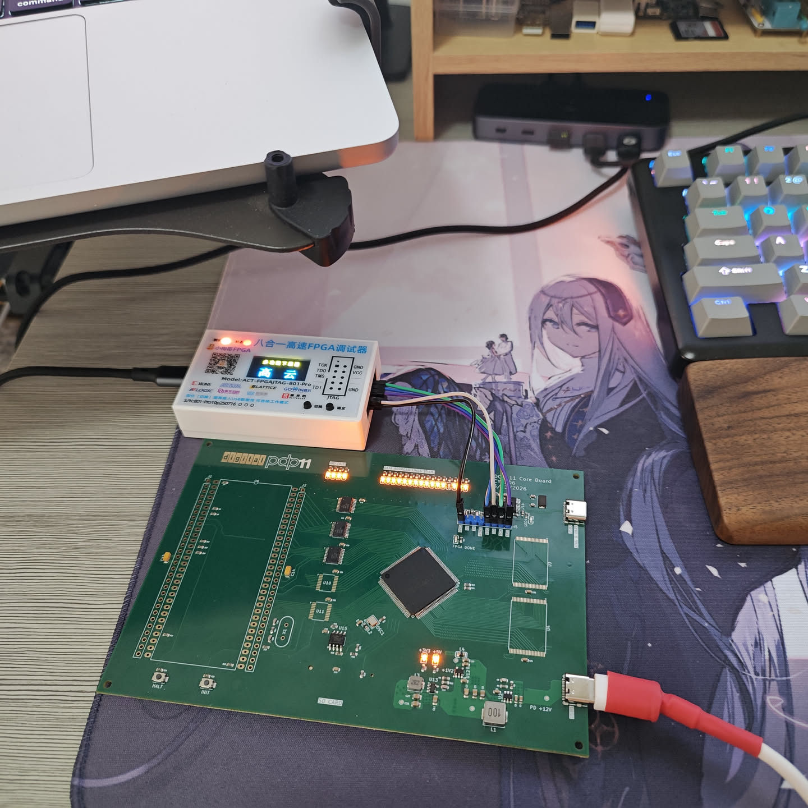

# PDP-11 Single-Board-Computer Replication Project

Temporary specification sheet for the DEC DCJ-11 and FPGA-based PDP-11 replication hardware. Using FPGA as a bus controller and emulating peripherals such as disk drives.

## Core Hardware (v1.0 - v1.1)
* **CPU:** DEC DCJ-11
* **FPGA:** Gowin GW1N-LV9LQ144
* **SRAM:** 2× CY62167EV30LL
* **Bus voltage conversion:** 5× SN74CB3T3245PWR

---

## Hardware Revisions

### v1.0 (Fabricated)

**Known Issues:**
* CH221K (USB PD): Missing series resistors on power lines.
* SD Slot: VCC and GND pins are inverted.
* CH347: Incompatible as a Gowin JTAG debugger.
* The absence of balanced copper on the top and bottom layers caused thermal expansion and contraction issues during SMT production.

### v1.1 (Unfabricated)
* Errata from v1.0 fixed in design files. Production bypassed.

### v1.2 (In Development)
* **Architecture Change:** Migrating to Altera Cyclone IV EP4CE15F23 and Raspberry Pi RP2040. Integrating original PDP-11 front panel status indicators.
