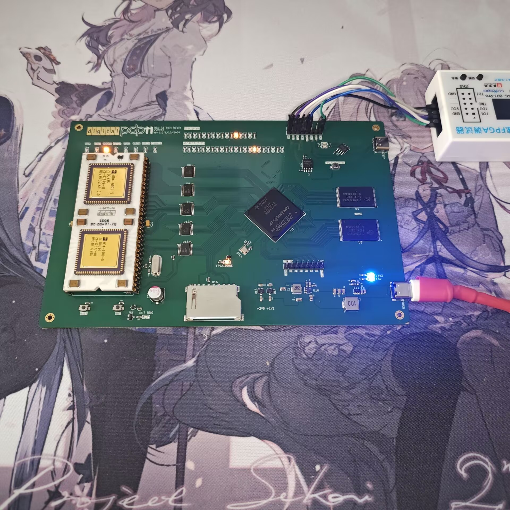
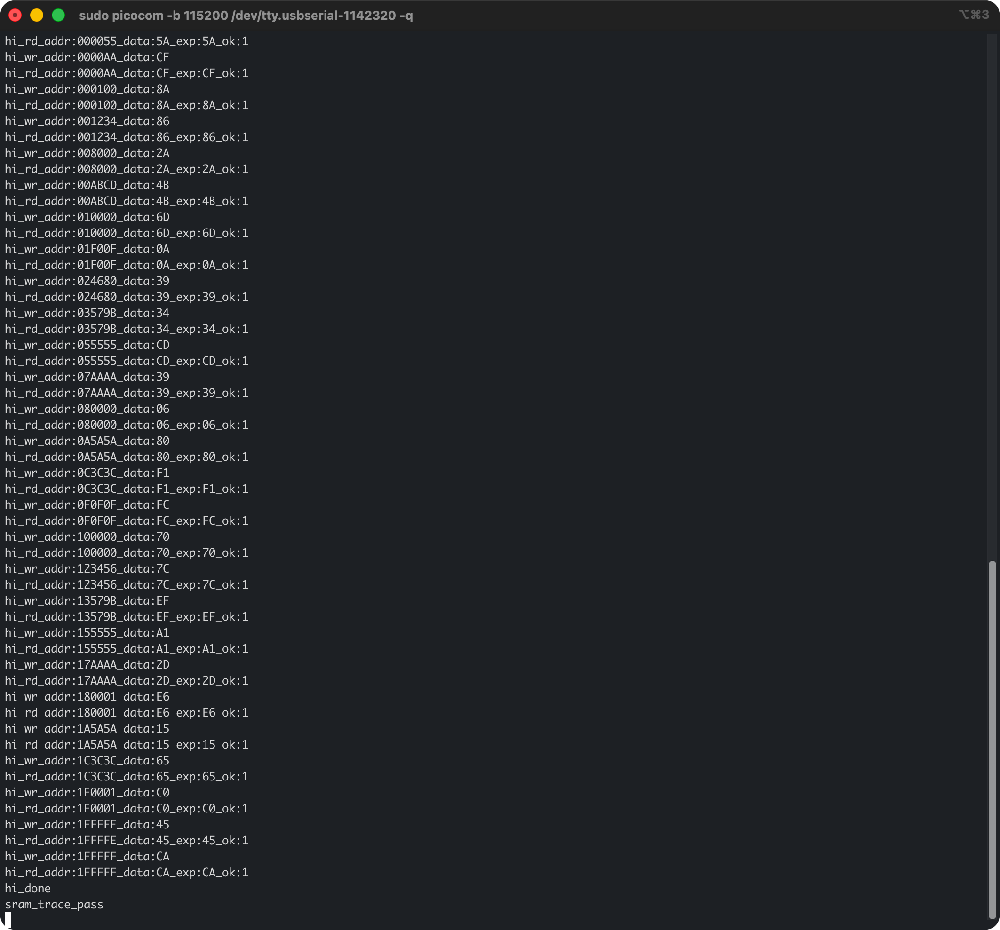
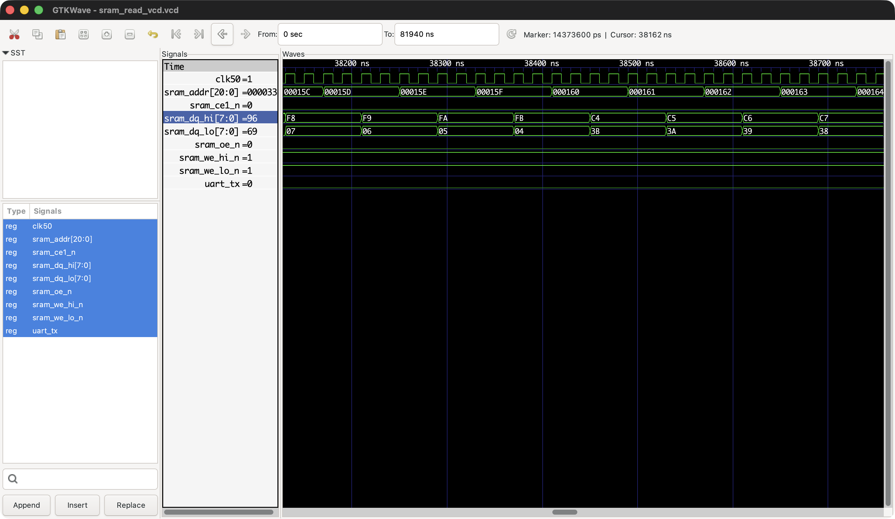
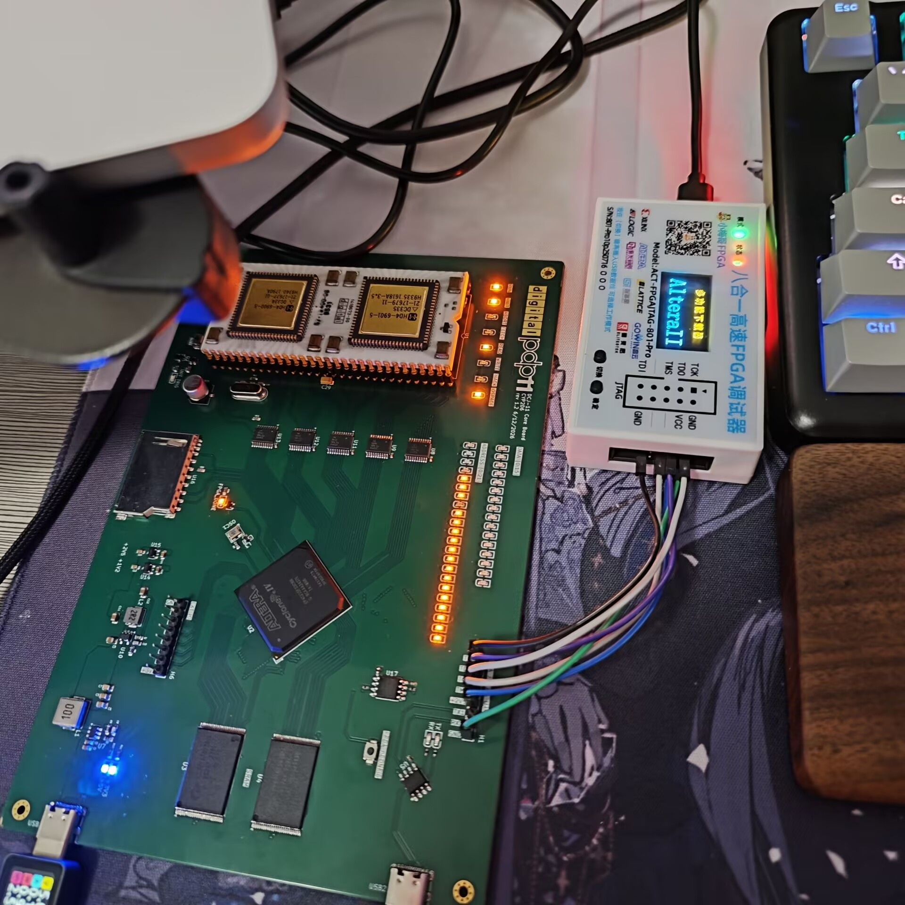
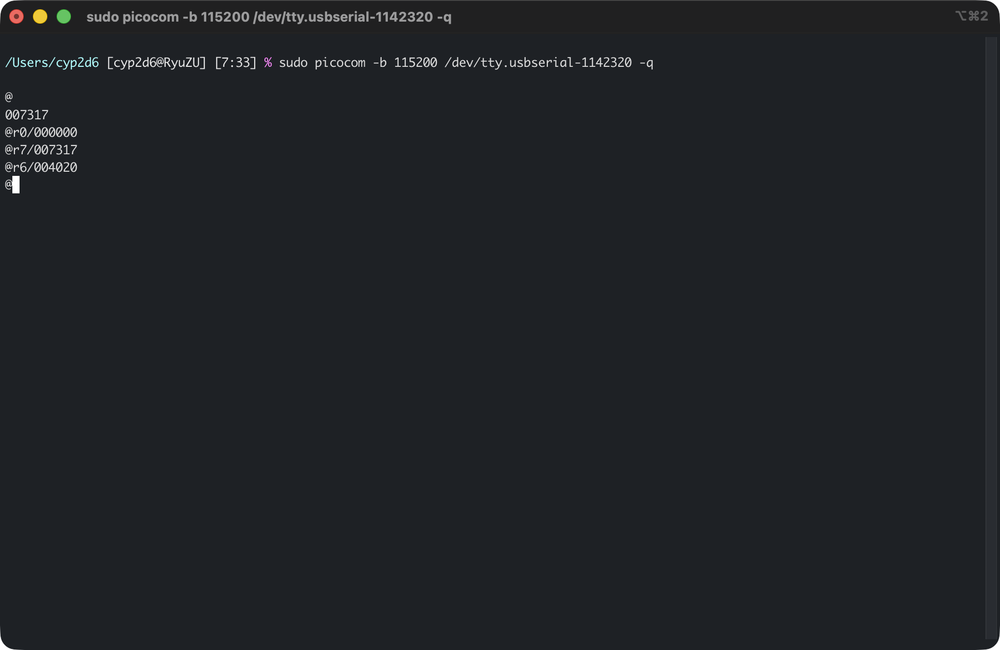
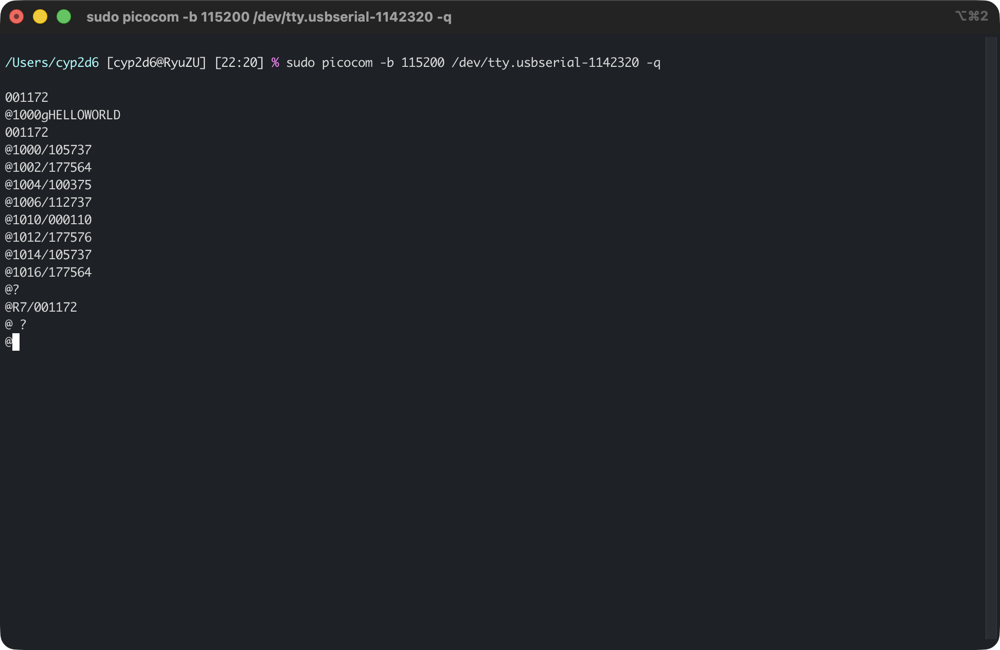

# DEC DCJ-11 PDP-11 Replication Project

Hardware specification and implementation status for the validated v1.2 hardware revision.

## Hardware Specifications (v1.2)

* **CPU:** DEC DCJ-11
* **FPGA:** Intel/Altera Cyclone IV EP4CE15F23C8N
* **SRAM:** 2× Cypress Semiconductor CY62167EV30LL-45/55ZXI
* **FPGA Configuration Flash:** Winbond W25Q64JVSSIQ
* **UART Interface:** WCH CH340N
* **Bus Transceivers:** 5× Texas Instruments SN74CB3T3245
* **LED Controllers:** 2× Awinic AW21024
* **Status Indicators:** 
    * 8× Onboard direct LEDs (RUN, HALT, ABORT, FETCH, READ, WRITE, IO_SPACE)
    * 16-bit Data bus and 22-bit Address bus LEDs (Driven via AW21024 controllers)

---

## Implementation and Validation Status

### Board-Level Hardware Bringup
Initial board-level hardware verification using Verilog to validate subsystem integrity.
* **Scope:** Individual validation of AW21024 controllers, SRAM interface, onboard status LEDs, and UART peripheral lines.

### Full System Integration (Hello World Project)
System-level integration project executing on the DCJ-11 CPU.
* **Functionality:** 
    * Power-on configuration initialization to enter Console ODT mode.
    * 2 KB (1 Kword) active SRAM memory mapping.
    * DEC KL11 compatible UART console interface configuration.
    * Dynamic bus status and address/data line LED mapping.
    * Pre-loaded execution code within SRAM executing a string print operation to the UART console.

